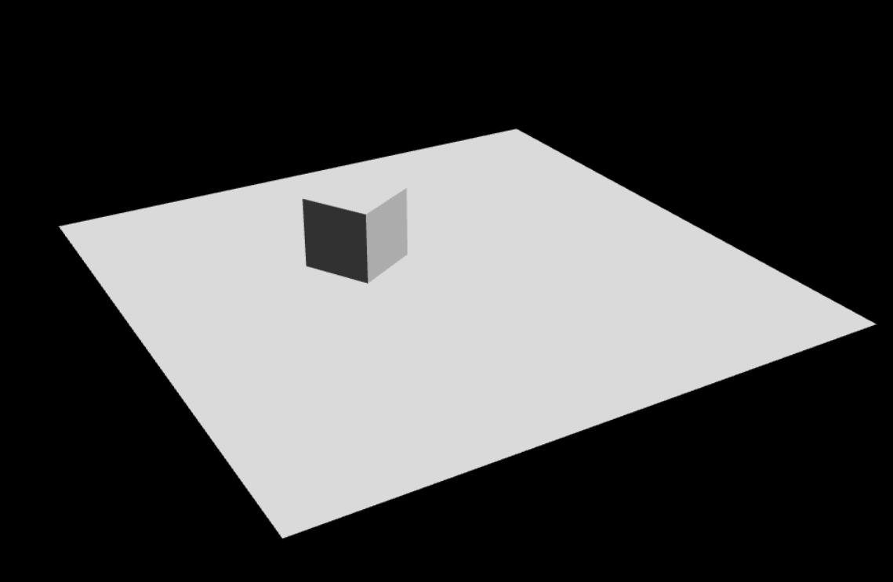

# babylonjs-typescript-template

<p align="center">
 
</p>

<p align="center">  
  A BabylonJS barebones in typescript using Ammo.js for a physics engine. 
<p>

<p align="center">
 
</p>


After clone the repository, install the npm packages

```
npm i
```

After installing the dependencies, run the server using

```
nodemon
```

---


write all your babylonjs code within the `src > public > typescript` directory.<br>
nodemon will automatically build, pack, and refresh nodejs.

#### Tech used:
- BabylonJS
- Ammo.js
- express
- ejs
- gulp
- webback

// TODO: add more stuffs to this
